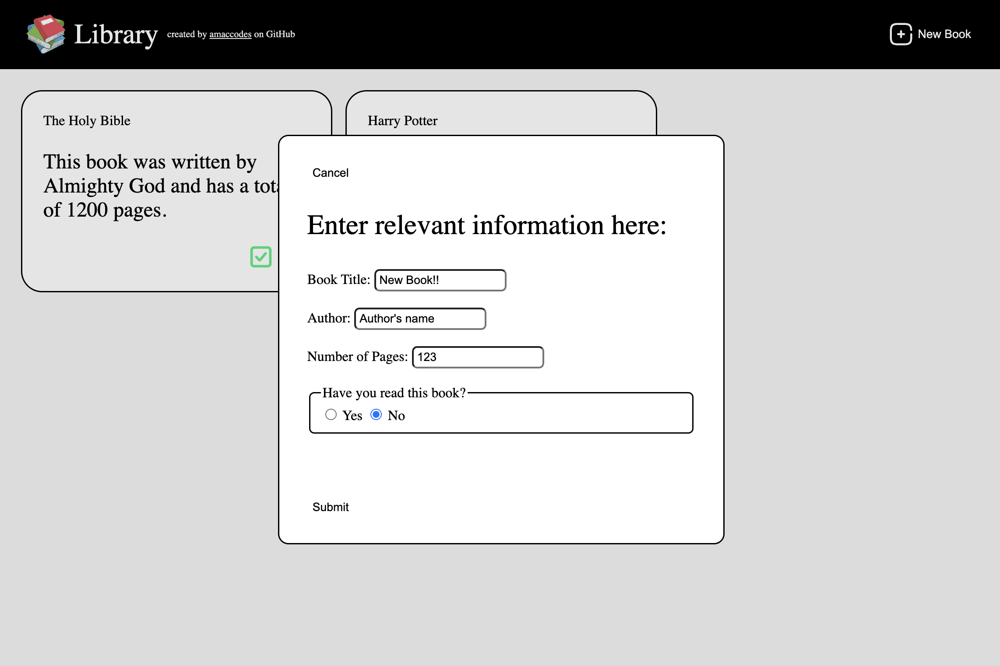

# 📚 Library

This is a project built as part of [The Odin Project's Full Stack JavaScript curriculum](https://www.theodinproject.com/paths/full-stack-javascript). It allows users to add, track, and remove books in a personal library using vanilla JavaScript, HTML, and CSS.

---

## 🚀 Features

- ✅ Add books with title, author, page count, and read status
- ✅ Display each book as a styled card
- ✅ Toggle whether a book has been read
- ✅ Delete books from the library
- ✅ Fully interactive form using `<dialog>` element
- ✅ Responsive layout using **CSS Grid** and **Flexbox**
- ✅ Unique book tracking using `crypto.randomUUID()`

---

## 🛠️ Technologies Used

- HTML5
- CSS3
- Vanilla JavaScript

---

## 📸 Screenshot

 <!-- Replace this with your own screenshot path -->

---

## 🧠 What I Learned

- Working with constructors and object-based data structures in JavaScript
- Creating dynamic UI using DOM methods (`createElement`, `appendChild`, `addEventListener`, etc.)
- Using `crypto.randomUUID()` to uniquely identify objects
- Implementing custom input validation and toggle logic
- Using `<dialog>` element for modals
